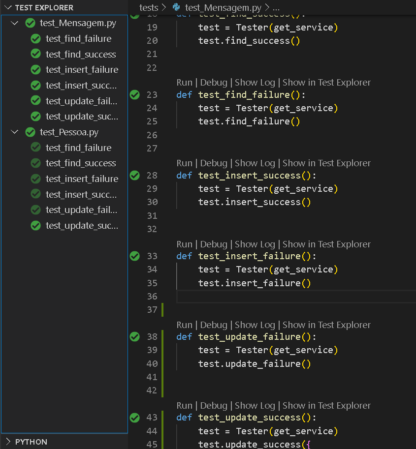

# Desafio Magalu Comunica

#####  por: `Júlio Cascalles`

```
Este projeto demonstra funções básicas de uma API de envio de mensagens com agendamento.
```

---

### Banco de dados
* Esta API pode rodar tanto com MySql como com Sqlite:
    - para usar com MySql abra o arquivo `/backend/service/db_connection.py` e (des)comente as linhas referentes à conexão desejada.
* Variáveis de ambiente (para usar com MySql)
    - MAGALU_USER
    - MAGALU_HOST
    - MAGALU_PASSWORD
* Tabelas


---
* ### Como rodar:
    * Configure as variáveis de ambiente no seu sistema operacional -- Exemplo:
        - `SET MAGALU_USER=root`
        - `SET MAGALU_HOST=localhost`
        - `SET MAGALU_PASSWORD=xyz1234`
    * Instale as dependências necessárias do Python, com...
        - `pip install -r requirements.txt`
    * Rode o back-end com...
        - `python app.py`

> Se você estiver usando Windows, disponibilizei o arquivo de lote `RUN.bat` para rodar a API.

---

### Rotas
* `/docs` Traz a documentação _Swagger_ com todos os verbos REST disponíveis para a API e exemplos funcionais 


* `/magalu/comunica/Pessoa` Pode ser usado para trazer várias pessoas (onde você pode passar uma query com os nomes dos campos, p.ex.: `...?nome=PESSOAxyz`)
    * você pode também passar o `.../<cpf_cnpj>` para operações que exigem um registro único
    (consula por campo chave ou exclusão)
    * Em caso de **POST** ou **PUT** é preciso passar o JSON adequado no _body_ da requisição.
    > Apesar de não ser responsabilidade desta API cadastrar pessoas, esta rota foi implementada para que a API fosse testável.

* `/magalu/comunica/Mensagem` Funciona igual _/magalu/comunica/Pessoa_ só que relaciona mensagens com as pessoas que enviam e as recebem.
    * No **PUT**, só é necessário passar os _cpf_cnpj_ ´s  e o que vai ser alterado.

---

### Testes unitários
As seguintes situações foram testadas para verificar se cada serviço está funcionando conforme esperado:


* Falha na busca: Deve retornar o status 404 quando não encontra o registro
* Sucesso na busca: Retorna o registro relacionado ao campo chave usado na busca;
* Falha de inclusão: Não permite registro com campos inválidos;
* Sucesso na inclusão: Simula a gravação de um registro e retorna sem erros;
* Falha na alteração: Não permite registro com campos inválidos;
* Sucesso na alteração: Altera o registro, localiza ele no banco de dados e compara com o esperado.




---

### Testes funcionais
Com a API rodando, o roteiro abaixo é executado, usando-se o comando `python generator.py`:


#### **Roteiro de testes:**

1) Criar a Pessoa 1
2) Criar a Pessoa 2
3) Criar a Mensagem 1 da P1 para P2
4) Criar a Pessoa 3
5) Criar a Mensagem 2 da P2 para P3
6) Criar a Mensagem 3 da P1 para P3
7) Criar a Mensagem 4 da P3 para P1
8) Consultar as mensagens não-enviadas de P1: 
	- Devem aparecer M1 e M3
9) Consultar as mensagens não-enviadas para P3:
	- Devem aparecer M2 e M3
10) Alterar a situação M1 como "enviada"
11) Repetir o passo 8
	- Deve aparecer somente M3
12) Alterar a situação de M3 como "enviada"
13) Repetir o passo 9
	- Deve aparecer somente M2
14) Repetir o passo 8
	Nenhuma mensagem deve ser listada
15) Consultar as mensagens não-enviadas
	- Devem aparecer M2 e M4
16) Consultar as mensagens enviadas
	- Devem aparecer M1 e M3
17) Deletar M3
18) Consultar todas as mensagens
	- Devem aparecer M1, M2 e M4
19) Repetir o passo 16
	- Deve aparecer apenas M1
20) Deletar M2
21) Repetir o passo 15
	- Deve aparecer apenas M4
22) Repetir o passo 18
	- Devem aparecer M1 e M4
